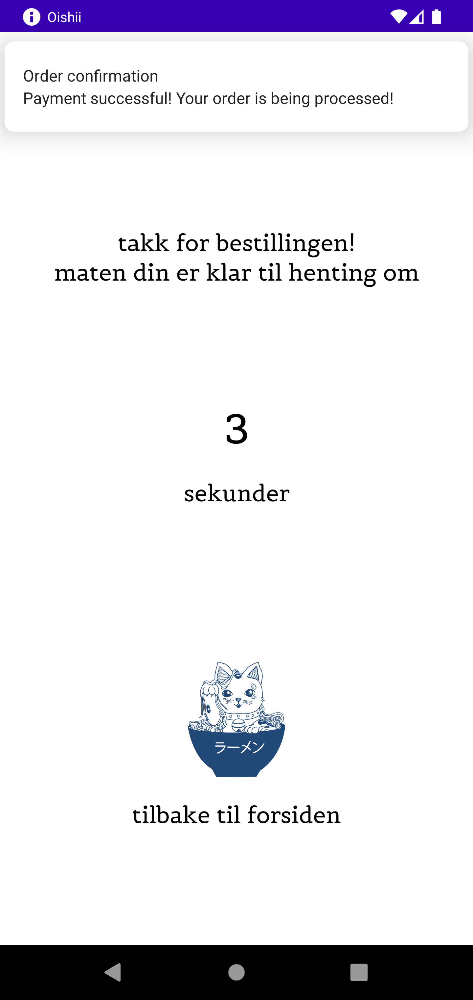

# Oishii

An android app that let's you buy and order food from the non-existent restaurant *Oishii*. 

## Purpose

This app was developed as part of an assignment during my studies. 
The design was created by design students.

## Screenshots

      

<!--   -->

## Features

- Stores data in *RoomDataBase* and *SharedPreferences*
- Toast
- Biometrics 
- Local notification
- Google maps with location pin
- Count-down timer
